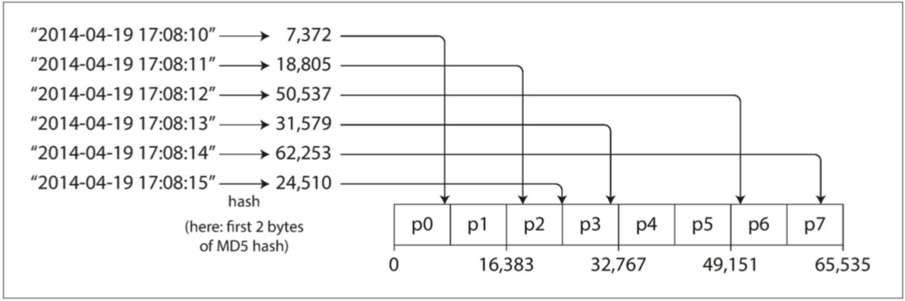
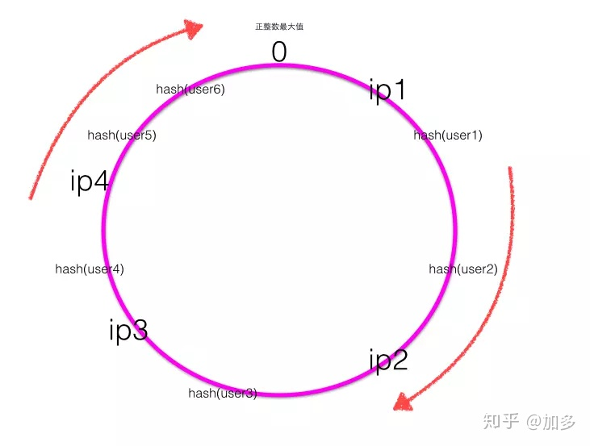

# 第6章 分区
## 本章内容简要
1. 什么是分区？
2. 怎么分区 - 分割数据集的方法
3. 分区后的次级索引
4. 重新平衡分区 - 节点增加或者删除后怎么重新平衡
5. 分区的路由问题 - 如何将请求路由到正确的分区

---
## 6.1 什么是分区？
上一章，复制——即同一份数据在不同节点上的副本。  
>节点：承载某个分区内容的物理节点，比如某个磁盘。

这一章，分区，把一个集合的数据，分散到几个集合里，分别存储。  


场景：
数据量非常大的时候，在单台机器上存储和处理不再可行，则分区十分必要。
分区的目标就是在多台机器上均匀分布数据，同时让查询负载也均匀分布。

- 优点：
数据可以扩展。
同时，每个分区可以执行不同的查询，简单的单区查询可以分布在多个分区上并行处理。

- 缺点：复杂的查询可能会跨越多个节点并行处理，尽管这也带来了新的负担。


## 6.2 怎么分区？

### 分区的原则
假如现在有10个节点，但是所有的负载都压在一个分区上，其余9个节点空闲的，整个系统的瓶颈落在这一个繁忙的节点上，效率就很低。  
这时那个高负载的分区就是热点。

所以分区的目标：将数据和查询负载均匀分布在各个节点上。  

文中提了两种分区方式：
### 1. 按键值范围进行分区

概念：就像字典一样，根据首字母来排序，每个分区包含了几个字母的键值。
```
分区1，包含字母A，B，C
分区2，包含字母D，E，F
分区3，包含字母G，H
.....
```
  
- 好处：每个分区里的内容是连续的，非常适合范围扫描
  
- 缺点：某些特定的访问模式会导致热点。 比如个别几个字母开头的单词被使用得特别多
---
### 2. 根据键的散列分区
			
通过散列函数来把Key打散，均匀得分布到一个数字空间范围里。切成几个部分。

```
比如散列后的数字范围是65535。
分区1  0    - 8191 
分区2  8192 - 16383
.....
```	
  

- 优点：key可以分散在各个空间里，减少热点。（但是，不能完全避免）
- 缺点：失去了高效执行范围查询的能力

引申 热点消除问题： 
``` 
假如对某个Key的操作特别频繁，此时这个分区还是会成为热点。怎么办？
```
在应用程序中对热点key单独处理。  
如果一个主键被认为是非常火爆的，一个简单的方法是把[主键]改成[主键+后缀名]的合集。  
> hotKey --> [hotKey1,hotKey2,hotKey3...hotKey10]    

把一个主键打散成10个，从而存储在不同的分区中。

注意点：
将主键进行分割之后，任何读取都必须要做额外的工作，  
因为他们必须从所有10个主键分布中读取数据并将其合并。

---

## 6.3 次级索引
假如现在一个二手车的网站，每辆车有一个全局ID，  
现在我突然想查找所有颜色为红色的车辆，此时颜色字段就是一个次级索引

- 情况1  根据键的范围进行分区，此时建立`本地索引`

  

图示内容：主键范围1-500为分区1，主键范围500-1000为分区2

三个特点：
1. 每个分区里都有次级索引。  每个分区维护自己的二级索引，不关心存储在其他分区的数据。
2. 当写入数据时更新数据很方便：无论何时需要写入数据库，只需处理包含正在编写的文档ID的分区即可。
3. 如果要搜索全部的红色汽车，则需要将查询发送到所有分区，并合并所有返回的结果。
这种查询分区数据库的方法有时被称为分散/聚集（scatter/gather）

---

- 情况2 全局索引  

  

图示内容：  
主键范围1-500为分区1，主键范围500-1000为分区2。  
颜色首字母从a到r的颜色在分区0中，s到z的在分区1。

索引数据本身按照键的范围，存放在不同的分区中


- 优点：读取更有效率，不需要分散/收集所有分区，客户端只需要向包含关键词的分区发出请求。
- 缺点：写入速度较慢且较为复杂，因为写入单个文档现在可能会影响索引的多个分区（文档中的每个关键词可能位于不同的分区或者不同的节点上）


## 6.4 分区再平衡
概念 将负载从集群中的一个节点向另一个节点移动的过程称为再平衡（reblancing）。

简单地说，目前集群中有9个数据节点正在服务，现在新加进来一个节点来分担压力，  
此时其他9个节点可以把部分数据放第10个节点里，需要进行数据的移动。

- 不推荐的策略：hash mod N  

hash环
  
例如，`hash(key) % 6` 会返回一个介于0和5之间的数字  
所以，一个key一定会在hash取余之后落在一个区间中
这里用6个节点平分，每个节点取一段，可以覆盖整个环空间

现在要增加删除节点，
比如节点数变成了5，新的计算方式变成 `hash(key) % 5` 
这就会返回一个介于0和4之间的数字，之前的大量数据需要进行迁移

---

- 推荐策略 - 固定分区

原本，集群有4个物理节点，把所有数据范围分成20个分区，每个节点放5个分区

现在新加一个节点，新节点可以从原本的每个节点中窃取一个分区，直到分区再次公平分配。

优点就是，只需要移动部分数据就完成了分区再平衡
  

- 动态分区  

在固定分区的基础上，实现动态创建分区。

当分区增长到超过配置的大小时（在HBase上，默认值是10GB），会被分成两个分区，每个分区约占一半的数据  
如果某个分区数据被大量删除导致分区缩小到某个阈值以下，则可以将其与相邻分区合并。

动态分区的一个优点是分区数量适应总数据量。  
上面的固定分区方式，后期有可能出现20个分区颗粒太大的情况。


## 6.5 请求路由
分区产生后的新问题：
> 随着分区重新平衡，分区在节点的位置也发生变化。作为客户端我怎么知道我想访问的分区目前在哪个节点上？

这个问题可以概括为 服务发现(service discovery) ，它不仅限于数据库。很多分布式的系统都会有这个问题。  
概括来说，这个问题有几种不同的方案

  


1. 循环策略的负载均衡：允许客户联系任何节点，如果该节点恰巧拥有请求的分区，则它可以直接处理该请求；否则，它将请求转发到下一个的节点进行处理。最坏的情况访问一圈。
2. 加一个路由层。此路由层本身不处理任何请求，它仅负责记录分区的负载均衡过程。
3. 客户端知道分区和节点的分配。在这种情况下，客户端可以直接连接到适当的节点，而不需要任何中介

这种三方式，都有一个关键问题：
> 作出路由决策的组件（可能是节点之一，还是路由层或客户端）如何了解分区-节点之间的分配关系变化？

文中提到，加一个独立的协调服务，比如使用ZooKeeper跟踪分区节点的变动。

  

每个节点在ZooKeeper中注册自己，ZooKeeper维护分区到节点的映射关系  
其他需要访问分区的角色可以在ZooKeeper中订阅此信息。   
只要分区分配发生的改变，集群中添加或删除了一个节点，ZooKeeper发布消息来通知其他角色，路由信息保持最新状态。