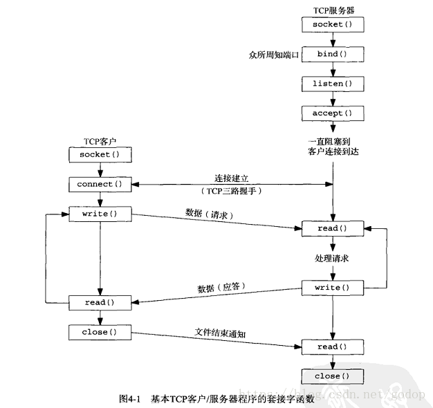
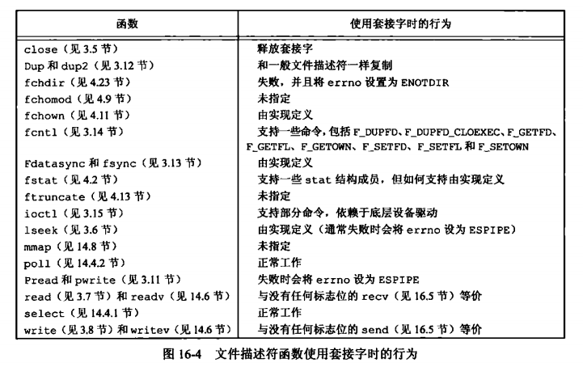
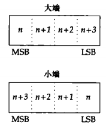
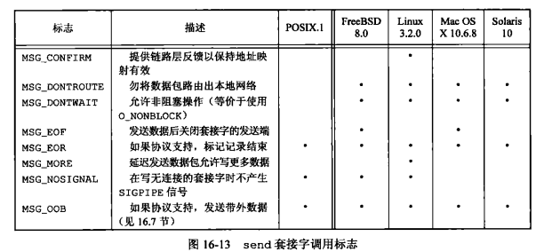
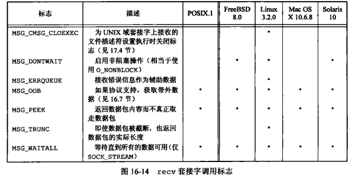
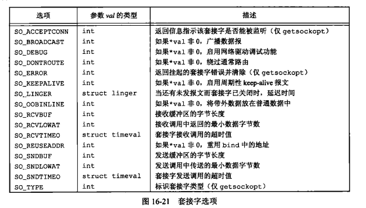

# 16.1 引言
上一章内容，主要讲同一台计算机内部的通信机制。  
经典进程间通信机制(IPC)：管道、命名管道、消息队列、信号量以及共享存储。

这一章讲网络上不同计算机之间的通信机制，socket  
主要就是客户端和服务端创建socket然后进行连接，发送和读取数据的过程。  
  
本章的内容主要就是这些函数的使用与参数介绍

---

# 16.2 套接字描述符
`套接字描述符`类似文件描述符，访问文件，使用文件描述符，访问套接字用套接字描述符。  
所以，他们之间很多函数都是类似的。很多处理文件描述符的函数也可以用于处理套接字描述符

### 创建一个套接字

```
#include <sys/socket.h>
int socket (int domain, int type, int protocol);
```
返回值：成功，返回socket描述符号；出错，返回-1


1.参数 domain  通信域  
表示socket对应的通信域，不同的域会有不同的地址格式

|  域   | 描述  |
|  ----  | ----  |
| AF_INET  | IPv4 |
| AF_INET6 | IPv6 |
| AF_UNIX  | UNIX域 |
| AF_UNSPEC  | 未指定 |  

>缩写`AF` = address family 地址族

2.参数 type
表示套接字的类型  

|  类型   |  描述  |  备注 |
|  -  | -  |  - |
| SOCK_DGRAM  | 无连接，不可靠，也不保证顺序的报文 | UDP |
| SOCK_STREAM | 面向连接，有序号，可靠的 字节流 |TCP |
| SOCK_RAW  | 原始套接字，可以直接访问IP层 |  |
| SOCK_SEQPACKET  | 类似SOCK_STREAM，有序，可靠，面向连接。面向报文 | |

注意点：  
- SOCK_RAW可以通过设置自己完全控制IP头的内容从而实现IP欺骗。（别的传输协议自动构造自己IP头部）
- SOCK_RAW可以处理普通的套接字无法处理ICMP、IGMP等网络报文
- TCP是面向字节流的，本身没有边界。UDP面向报文段，有报文边界，会有一个中止符（MSG_EOR）

3.参数 protocol 使用的协议  
一般填0，也就是默认的通信协议   
SOCK_STREAM 默认 TCP  | SOCK_DGRAM 默认UDP

---

## 套接字函数

- 很多文件描述符的函数可以用在套接字描述符上。  
    比如 `close` 释放套接字 也可以用来释放文件描述符  
- 也有一些文件描述符的函数，不能用于套接字。
    比如：`lseek`  文件有一个偏移量，类似目前光标的位置  
套接字不行。没有文件偏移量的概念。


图16-4 两种套接字函数的详细区别  
  

---

## shutdown函数
socket是双向的，可以使用shutdown来禁止套接字的I/O  
```
#Include <sys/socket.h>
int shutdown (int sockfd, int how);
```
- 返回值 0 表示成功，-1表示出错  
- 参数：how  
  * SHUT RD（关闭读端）  那么无法从套接字读取数据
  * SHUT WR（关闭写端），那么无法使用套接字发送数据。
  * SHUT RDWR 则既无法读取数椐，又无法发送数据

### `shutdown()`与`close()`的区别：  
1.shutdown可以单向关闭  
2.shutdown立即关闭。close不一定能立即关闭。  
>比如有多个进程共享一个套接字，close每被用一次，计数减1,  
直到计数为0时，也就是所有分享的进程都调用过close，这个套接字才被释放

---

# 16.3 寻址
## 3.1 字节序的概念：
* 字节序是一个CPU架构特性,用于指示像int32这样的类型内部的字节如何排序。
* 字节序分为大端和小端，比如一个int32,可以是大端字节序表示也可以是小端字节序表示。
    
    大端：高位字节排放在内存的低地址端，低位字节排放在内存的高地址端。  
    小端：低位字节排放在内存的低地址端，高位字节排放在内存的高地址端。

     

* 一个十进制整数1234，最高是1，最低位是4。在大端和小端两种情况下，内存地址其实是反着来的。  
    大端 内存低位 1 2 3 4  内存高位  
    小端 内存低位 4 3 2 1  内存高位

* 同一台计算机上的内部进程进行通信时，不用考虑字节序。不同cpu计算机交换信息需要考虑字节序
* 网络协议指定了字节序，TCP/IP协议栈使用大端字节序。
* 有些CPU可能使用小端字节序，此时需要把字节序转换一下。  
    系统提供四个转换字节序的函数:
```
    #include <arpa/inet.h>
    uint32_t htonl(uint32_t hostlong);  // 返回网络字节序表示int32
    uint16_t htons(uint16_t hostshort); // 返回网络字节序表示int16
    uint32_t ntohl(uint32_t netlong);   // 返回主机字节序表示int32
    uint16_t ntohs(uint16_t netshort);  // 返回主机字节序表示int16
```

发到网络上的数据必须是网络字节序(大端)，
你的主机字节序原本就是大端模式，那么你可以考虑不用将通信数据转换为网络字节序。  
但如果你的主机字节序是小端，那么通信数据必须被上面提及到的其中某个函数进行处理，转换成网络字节序后方可使用。

## 3.2 地址格式
unix下通用的地址结构sock addresss:
```
struct sockaddr{
    sa_family_t  sa_family；  /*地址族*/
    char sa_data[];    /*地址数据*/
    ..
};
```

前面说过，不同的通信域会有不同的地址格式,  
对于AF_INET域对应的IPv4，一般使用`sockaddr_in`来表示地址
```
struct in_addr {
    in_addr_t    s_addr;   // 表示ipv4地址
};

struct sockaddr_in{
    sa_family_t   sin_family;   // 通信域对应的地址族 AF_INET
    in_port_t      sin_port;    // 端口
    struct  in_addr  sin_addr;  // ipv4地址
};
```

AF_INET6域对应的IPv6地址，一般使用`sockaddr_in6`来表示地址
```
struct sockaddr_in6 {
    sa_family_t sin6_family;    /* Address family AF_INET6 */
    in_port_t   sin6_port;    
    uint32_t  sin6_flowinfo;    /* 流信息，应设置为0  */
    struct int6_addr sin6_addr  /* IPv6地址结构体 */
    u_int32_t sin6_scope_id;    / * scope Id.尚处于试验阶段  */
};
```

>ipv4对应`sockaddr_in`，ipv4对应`sockaddr_in6`，这两种结构区别比较大。  
但是在实际使用时，都会被强制转换为通用`sockaddr`类型，  
所有socket相关函数都接受使用`sockaddr`作为地址参数


### 地址格式的转换

计算机使用二进制的地址格式，如何转换成192.168.0.1这样的十进制可读格式？

这里提供两个IP地址转换函数：
```
#include<arpa/inet.h>
// 二进制地址转化为192.168.0.1格式
const char *inet_ntop(int domain, const void * restrict addr, char *restrict str, socklen_t size );  

// 字符串地址转为二进制地址
int *inet_pton( int domain, const char *restrict str, void * restrict addr );
```
参数domain 可以为AF_INET或者AF_INET6

## 3.3 地址查询
系统目录`/etc`下面有很多文件保留网络相关的配置，比如host之类的。  
访问这些文件的数据，unix有一套对应的函数。

1.`/etc/hosts` 这个目录放域名与主机IP地址之间的映射


三个函数 - 域名-IP地址的查询
```
#include <netdb.h>
void sethostent (int stayopen);     // 打开hosts文件
struct hostent *gethostent(void);   // 返回下一条数据
void endhostent (void);             // 关闭文件
```
每次调用gethostent，都会返回一个指向hostent的结构体指针  
hostent是host entry的缩写,entry表示一个文件中的一个条目  
该结构记录主机的信息，包括主机名、别名、地址类型、地址长度和地址列表。
> 为啥是地址列表？因为一台机器可能有多块网卡
```
struct  hostent {  
    char    *h_name;	     /* official name of host */
    char    **h_aliases;     /* alias list */
    int     h_addrtype;      /* host address type */
    int     h_length;	     /* length of address */
    char    **h_addr_list;   /* list of addresses from name server */
};
```
2.`/etc/networks` 网络名和网络地址之间的映射关系  
前面是域名对应IP地址的关系，关于获取网络名，网络地址也有一套相似的函数。
```
#include<netdb.h>
struct netent *getnetbyaddr(uint32_t net, int type);
struct netent *getnetbyname(const char *name);
struct netent *getnetent(void);
void setnetent(int stayopen);
void endnetent(void);
```
每次调用getnetent，都会返回一个指向netent的结构体指针  
netent是net entry的缩写,该结构记录网络的信息，  
```
struct netent{
    char *n_name;       //network name
    char **n_aliases;   //alternate network name array pointer
    int n_addrtype;     //address type
    uint32_t n_net;     //network number
    ...
};
```
3.`/etc/protocols` 协议名字和协议编号之间的映射关系  
里面记录了TCP/IP协议族的所有协议类型。文件中的每一行对应一个协议类型。
```
struct protoent *getprotoent(void);
struct protoent *getprotobyname(const char *name);
struct protoent *getprotobynumber(int proto);
void setprotoent(int stayopen);
void endprotoent(void);

struct protoent {
    char *p_name;			/* Official protocol name.  */
    char **p_aliases;		/* Alias list.  */
    int p_proto;			/* Protocol number.  */
};
```

/etc/protocols 示例
它有3个字段，中间用TAB或空格分隔，分别表示“协议名称”、“协议号”和“协议别名”。
```
ip      0       IP              # internet protocol, pseudo protocol number
#hopopt 0       HOPOPT          # IPv6 Hop-by-Hop Option [RFC1883]
icmp    1       ICMP            # internet control message protocol
igmp    2       IGMP            # Internet Group Management
ggp     3       GGP             # gateway-gateway protocol
```

4.`/etc/services` 文件保存了服务名和端口的对应关系(非强制)
```
struct servent *getservent(void);
struct servent *getservbyname(const char *name, const char *proto);
struct servent *getservbyport(int port, const char *proto);
void setservent(int stayopen);
void endservent(void);

struct servent
{
    char *s_name;			/* Official service name.  */
    char **s_aliases;		/* Alias list.  */
    int s_port;			    /* Port number.  */
    char *s_proto;		    /* Protocol to use.  */
};
```

查询地址的新函数 `getaddrinfo`  
用来输入主机名服务名，返回相应的一个ip地址和端口。
```
#include <netdb.h>
int getaddrinfo(const char *restrict host,      // 域名
        const char *restrict service,           // 服务名
        const struct addrinfo *restrict hint,   // 配置一些基本值进行过滤
        struct addrinfo **restrict res);        // 指向结果的链表

void freeaddrinfo(struct addrinfo *ai);  // 释放结果链表的数据
```
调用getaddrinfo查询后返回一个addrinfo的结果，这是一个链表串起来的结果  

```
struct addrinfo {
    int              ai_flags;      // 服务端 AI_PASSIVE
    int              ai_family;     // AF_INET ipv4, AF_INET6 ipv6...
    int              ai_socktype;   // 流 SOCK_STREAM  报文 SOCK_DGRAM
    int              ai_protocol;   // 一般取0，默认协议。TCP或者UDP
    socklen_t        ai_addrlen;
    struct sockaddr *ai_addr;
    char            *ai_canonname;
    struct addrinfo *ai_next;       // 下一个成员
};
```
参数hint，进行通过配置值来进行一些过滤，  
比如指定的服务既支持TCP也支持UDP，hint.ai_socktype = SOCK_STREAM，表示只要tcp的查询结果


函数 `getnameinfo` 功能与 `getaddrinfo` 相反，传入socket地址返回对应的主机名和服务名。
```
#include <sys/socket.h>
#include <netdb.h>
int getnameinfo(const struct sockaddr *restrict addr, socklen_t alen,
                    char *host, size_t hostlen,
                    char *serv, size_t servlen, int flags);
```
参数 host、serv指向缓冲，来存放返回的主机名和服务名  
flags参数提供一些控制翻译的方式  

|  标志   |  描述  |
|  -  | -  |
| NI_DGRAM  | 服务基于数据报而非基于流 |
| NI_NAMEREQD | 如果找不到主机名，将其作为一个错误对待 |
| NI_NOFQDN  | 对于本地主机，仅返回全限定域名的节点名部分 |
| NI_NUMERICHOST  | 返回主机地址的数字形式，而非主机名 |   
| -  | - |   


下面使用 `getaddrinfo` 进行打印地址信息的例子
```
void print_family(struct addrinfo *aip) { // 打印地址族
	printf(" family ");
	switch (aip->ai_family) {
	case AF_INET:
		printf("inet");
		break;
	case AF_INET6:
		printf("inet6");
		break;
	case AF_UNIX:
		printf("unix");
		break;
	case AF_UNSPEC:
		printf("unspecified");
		break;
	default:
		printf("unknown");
	}
}

void
print_type(struct addrinfo *aip) // 打印套接字的类型 
{
	printf(" type ");
	switch (aip->ai_socktype) {
	case SOCK_STREAM:
		printf("stream");
		break;
    ...
	}
}

void
print_protocol(struct addrinfo *aip) // 打印套接字使用的协议
{
    ...
}

int
main(int argc, char *argv[])
{
    ...
	if ((err = getaddrinfo(argv[1], argv[2], &hint, &ailist)) != 0) // 调用getaddrinfo
		err_quit("getaddrinfo error: %s", gai_strerror(err));
	for (aip = ailist; aip != NULL; aip = aip->ai_next) { // 遍历查询结果的链表
		print_flags(aip); 
		print_family(aip);
        ...
		if (aip->ai_family == AF_INET) { // 这里只打印ipv4协议下的内容
			sinp = (struct sockaddr_in *)aip->ai_addr;
            // 地址转换成转化为192.168.0.1格式
			addr = inet_ntop(AF_INET, &sinp->sin_addr, abuf,  
			    INET_ADDRSTRLEN);
			printf(" address %s", addr?addr:"unknown");
			printf(" port %d", ntohs(sinp->sin_port));
		}
	}
}
```
运行参数  ./a.out harry nfs   
"harry" 主机名  
"nfs" = nfs协议，一个文件共享协议，会固定监听 TCP/UDP 2049端口  
返回
```
flags canon family inet type stream protocol TCP
host harry address 192.168. 1.99 port 2049
flags canon family inet type datagram protocol UDP
host harry address 192. 168.1.99 port 2049
```

## 3.4 将套接字与地址关联

服务端的某一个服务需要绑定到某个地址
```
#include<sys/socket.h>
int bind(int sockfd,  const struct sockaddr, socklen_t addrlen);
```

绑定地址时会有一些要求：
- 在进程正在运行的计算机上，指定的地址必须是有效的；不能指定一个其他机器的地址。
- 这个地址必须和创建套接字时的地址族所支持的格式相匹配
- 地址中的端口号必须不小于1024,除非该进程具有超级用户权限
- 一般只能将一个套接字绑定到一个给定地址上

下面两个函数,用来查询一个socket所绑定的地址  
函数 `getsockname` 查询socket关联的本地协议地址  
函数 `getpeername` 假如socket已经连上，查询socket关联的对方地址
```
#include<sys/socket.h>
int getsockname(int sockfd, struct sockaddr *localaddr, socklen_t *addrlen);
int getpeername(int sockfd, struct sockaddr *peeraddr, socklen_t *addrlen);
```

# 16.4 建立连接

### 客户端 `Connect()` 发起连接

```
#include <sys/socket.h>
int connect(int sockfd, const sockaddr *addr, socklen_t len);
                    返回值：若成功，返回0；若出错，返回-1
```
1. 如果sockfd还没有绑定到一个地址，connect会给调用者一个默认的地址  
2. connect函数还可用与无连接的网络服务（SOCK_DGRAM - UDP）  
   如果SOCK_DGRAM套接字调用connect，传送的报文的目的地址会设置成connect调用中所制定的地址。  
   同时，也只能接收来自指定地址的报文。

当尝试 `Connect()` 连接服务器时，出于一些原因连接可能会失败。所以需要进行多次尝试。  
代码示例：
```
int
connect_retry(int sockfd, const struct sockaddr *addr, socklen_t alen)
{
	int numsec;

	/*
	 * Try to connect with exponential backoff.
	 */
	for (numsec = 1; numsec <= MAXSLEEP; numsec <<= 1) {
		if (connect(sockfd, addr, alen) == 0) {
			/*
			 * Connection accepted.
			 */
			return(0);
		}

		/*
		 * Delay before trying again.
		 */
		if (numsec <= MAXSLEEP/2)
			sleep(numsec);
	}
	return(-1);
}
```
>如果调用 connect失败，进程会休眠一小段时间，然后进入下次循环再次尝试，  
每次循环休眠时间会以指数级增加，直到最大延迟为2分钟左右。

上面那段代码在Linux下可以正常工作，但是在FreeBSD和Mac OS X上运行会出现问题。  
这里有一个小细节，不同的系统对socket的实现有区别。  
在基于BSD的套接字实现中，如果socket第一次连接失败，那么在TCP中继续使用同一个socket连接，接下来仍旧会失败。  
为了让上面那段代码在不同的系统跑起来，需要进行修改
```
int
connect_retry(int domain, int type, int protocol,
              const struct sockaddr *addr, socklen_t alen)
{
	int numsec, fd;

	/*
	 * Try to connect with exponential backoff.
	 */
	for (numsec = 1; numsec <= MAXSLEEP; numsec <<= 1) {
		if ((fd = socket(domain, type, protocol)) < 0) // 新的套接字
			return(-1);
		if (connect(fd, addr, alen) == 0) {
			/*
			 * Connection accepted.
			 */
			return(fd);
		}
		close(fd); // 失败就关闭 

		/*
		 * Delay before trying again.
		 */
		if (numsec <= MAXSLEEP/2)
			sleep(numsec);
	}
	return(-1);
}
```
connect失败后进行close，后面重试时，打开一个新的套接字。

### 服务器 `listen()`  开始监听

```
#include <sys/socket.h>
int listen(int sockfd, int backlog);
                    返回值：若成功，返回0；若出错，返回-1
```

参数 backlog来控制期望负载，服务端会有一个队列，  
一旦外部连接请求超过目前队列数的最大限制，系统就会拒绝多余的连接请求

### 服务器 `accept()`  接受请求
```
#include <sys/socket.h>
int accept(int sockfd, struct sockaddr *restrict addr, socklen_t *restrict len);
            返回值：若成功，返回套接字描述符；若出错，返回-1
```
返回的是新套接字描述符，这个socket连接到外部调用connect的客户端。  
而作为参数传入的`int sockfd`没有关联到这个连接，而是继续保持可用状态并接收其他连接请求。


accept存在非阻塞模式
- 阻塞模式：如果没有连接请求在等待，accept会阻塞直到一个请求到来。
- 非阻塞模式：如果没有连接请求在等待，accept会返回-1,并将errno设置一个标识EAGAIN.

代码示例 初始化一个服务端的socket
```
int
initserver(int type, const struct sockaddr *addr, socklen_t alen,
  int qlen)
{
	int fd;
	int err = 0;

	if ((fd = socket(addr->sa_family, type, 0)) < 0) // 1
		return(-1);
	if (bind(fd, addr, alen) < 0)  // 2
		goto errout;
	if (type == SOCK_STREAM || type == SOCK_SEQPACKET) {
		if (listen(fd, qlen) < 0)  // 3
			goto errout;
	}
	return(fd);

errout:
	err = errno;
	close(fd);
	errno = err;
	return(-1);
}
```

# 16.5 数据传输

socket建立之后，可以将套接字描述符传递给那些原先为处理本地文件而设计的函数

比如read / write  等处理本地文本的函数都可以使用

一共有6个函数用来处理数据的读取和接受


3个函数用来发送数据，3个用于接收数据。

```
#include <sys/types.h>
#include <sys/socket.h>

ssize_t send(int sockfd, const void *buf, size_t len, int flags);
ssize_t sendto(int sockfd, const void *buf, size_t len, int flags,
                    const struct sockaddr *dest_addr, socklen_t addrlen);
ssize_t sendmsg(int sockfd, const struct msghdr *msg, int flags);
```

```
#include <sys/types.h>
#include <sys/socket.h>

ssize_t recv(int sockfd, void *buf, size_t len, int flags);

ssize_t recvfrom(int sockfd, void *buf, size_t len, int flags,
                struct sockaddr *src_addr, socklen_t *addrlen);

ssize_t recvmsg(int sockfd, struct msghdr *msg, int flags);
```

`send`函数   
- `write`有三个参数，`send`第四个参数`flags`，用于改变处理传输数据的方式。
- 不同OS的实现也不同，只支持个别标识。比较混乱。  
     

- send成功执行表示你发送的数据成功到达网卡，并不表示另一端进程收到了数据。
- 对于字节流协议，send会阻塞直到整个数据传输完成。

 `recv`函数  
- 类似send,多一个flags，用于改变处理传输数据的方式。  
     
- 当指定MSG_PEEK标志时，可以查看下一个要读取的数据但不真正取走它。
- 标志`MSG_ WAITALL` 针对SOCK STREAM套接字 所请求的数据全部返回，recv函数才会返回
- 发送者已经调用 shutdown，那么当所有的数据接收完毕后，recv会返回0.

函数 `sendto`

函数 `sendto`和`send`很类似。一般用在无连接的套接字上。
面向连接的socket,在调用connect时已经设置了目标地址，
无连接的套接字要么先调用 connect设置了目标地址，然后使用send。
假如没有调用connect，不能使用send. 需要使用sendto来设定地址。

函数`recvfrom` 用在无连接的套接字，否则等同于recv


函数`sendmsg`  

这个函数把大部分参数封装到一个 `msghdr` 结构体中
发送时带有自定义结构 msghdr *msg
```
struct msghdr {
    void          *msg_name;        // protocol address
    socklen_t      msg_namelen;     // size of protocol address
    struct iovec  *msg_iov;         // 指向输入或输出缓冲区
    int            msg_iovlen;      // 上面的长度
    void          *msg_control;     // 指定可选的辅助数据
    socklen_t      msg_controllen;  // 上面的长度
    int            msg_flags;       // flags returned by recvmsg()
};
```

msg_name
- 假如是已经连接的TCP 或者 UDP ，msg_name应该为空
- 假如socket未连接，msg_name置为目标的协议地址
  
`函数recvmsg`  也把大部分参数封装到 msghdr 结构体中

接收辅助数据 | 为了将接收到的数据送入多个缓冲

代码示例 面向连接的客户端 流式数据的接收
```
void
print_uptime(int sockfd)
{
	int		n;
	char	buf[BUFLEN];

	while ((n = recv(sockfd, buf, BUFLEN, 0)) > 0)
		write(STDOUT_FILENO, buf, n);
	if (n < 0)
		err_sys("recv error");
}

int
main(int argc, char *argv[])
{
	struct addrinfo	*ailist, *aip;
	struct addrinfo	hint;
	int				sockfd, err;

	if (argc != 2)
		err_quit("usage: ruptime hostname");
	memset(&hint, 0, sizeof(hint));
	hint.ai_socktype = SOCK_STREAM;
	hint.ai_canonname = NULL;
	hint.ai_addr = NULL;
	hint.ai_next = NULL;
	if ((err = getaddrinfo(argv[1], "ruptime", &hint, &ailist)) != 0)
		err_quit("getaddrinfo error: %s", gai_strerror(err));
	for (aip = ailist; aip != NULL; aip = aip->ai_next) {
		if ((sockfd = connect_retry(aip->ai_family, SOCK_STREAM, 0,
		  aip->ai_addr, aip->ai_addrlen)) < 0) {
			err = errno;
		} else {
			print_uptime(sockfd);
			exit(0);
		}
	}
	err_exit(err, "can't connect to %s", argv[1]);
}
```
- 这个客户端连接服务器，从socket中接收服务器发送过来的字符串  
并将其打印到标准输出。  
- 因为使用的是SOCK_STREAM套接字，所以不能保证调用一次recv就会读取整个字符串，因此需要重复调用直到它返回0.

代码示例 对应的面向连接的服务端
```
void
serve(int sockfd)
{
	int		clfd;
	FILE	*fp;
	char	buf[BUFLEN];

	set_cloexec(sockfd);
	for (;;) {
		if ((clfd = accept(sockfd, NULL, NULL)) < 0) {
			syslog(LOG_ERR, "ruptimed: accept error: %s",
			  strerror(errno));
			exit(1);
		}
		set_cloexec(clfd);
		if ((fp = popen("/usr/bin/uptime", "r")) == NULL) {
			sprintf(buf, "error: %s\n", strerror(errno));
			send(clfd, buf, strlen(buf), 0);
		} else {
			while (fgets(buf, BUFLEN, fp) != NULL)
				send(clfd, buf, strlen(buf), 0);
			pclose(fp);
		}
		close(clfd);
	}
}


int
main(int argc, char *argv[])
{
	struct addrinfo	hint;
    ...
	hint.ai_flags = AI_CANONNAME;
	hint.ai_socktype = SOCK_STREAM;
	hint.ai_canonname = NULL;
	hint.ai_addr = NULL;
	hint.ai_next = NULL;
	if ((err = getaddrinfo(host, "ruptime", &hint, &ailist)) != 0) {
		syslog(LOG_ERR, "ruptimed: getaddrinfo error: %s",
		  gai_strerror(err));
		exit(1);
	}
	for (aip = ailist; aip != NULL; aip = aip->ai_next) {
		if ((sockfd = initserver(SOCK_STREAM, aip->ai_addr,
		  aip->ai_addrlen, QLEN)) >= 0) {
			serve(sockfd);
			exit(0);
		}
	}
	exit(1);
}

```
- 使用popen来运行 uptime命令，并从连接到命令标准输出的管道读取输出
- popen、pclose 标准I/O函数库  
启动一个子进程去执行一个shell命令行  
popen函数还创建一个管道用于父子进程间通信  
新开的child process中执行/usr/bin/uptime这个命令  
然后再利用pipe把uptime执行完成的结果读到parent process的buffer中，然后再send回client中。  


关于函数set_cloexec的代码
```
int
set_cloexec(int fd)
{
	int		val;

	if ((val = fcntl(fd, F_GETFD, 0)) < 0)
		return(-1);

	val |= FD_CLOEXEC;		/* enable close-on-exec */

	return(fcntl(fd, F_SETFD, val));
}
```

>为什么要 set_cloexec(fd)？  
因为后面调用的popen函数，其内部实现机制用了fork+pipe+exec的机制。  
一旦有了fork和exec，就涉及到了parent process的memory layout复制到child process memory layout的问题。  
即，child process也可以有一个clfd，并且child process的clfd也与client关联的那个socket。  
我们知道，child process的作用就是执行一个uptime command，是不需要跟client发生什么关联的。所以，可以通过set_cloexec这个函数来给clfd的flag置位。  
目的就是在fork+exec之后，将clfd给close了，这里的close并不是直接把sockfd给删除了，而是让其断开与某个client的联系。  


代码示例 另一个面向连接的服务器
```
void
serve(int sockfd)
{
	int		clfd, status;
	pid_t	pid;

	set_cloexec(sockfd);
	for (;;) {
		if ((clfd = accept(sockfd, NULL, NULL)) < 0) { // 1
			syslog(LOG_ERR, "ruptimed: accept error: %s",
			  strerror(errno));
			exit(1);
		}
		if ((pid = fork()) < 0) { // 2
			syslog(LOG_ERR, "ruptimed: fork error: %s",
			  strerror(errno));
			exit(1);
		} else if (pid == 0) {	/* child */
			/*
			 * The parent called daemonize ({Prog daemoninit}), so
			 * STDIN_FILENO, STDOUT_FILENO, and STDERR_FILENO
			 * are already open to /dev/null.  Thus, the call to
			 * close doesn't need to be protected by checks that
			 * clfd isn't already equal to one of these values.
			 */
			if (dup2(clfd, STDOUT_FILENO) != STDOUT_FILENO || //3
			  dup2(clfd, STDERR_FILENO) != STDERR_FILENO) {
				syslog(LOG_ERR, "ruptimed: unexpected error");
				exit(1);
			}
			close(clfd);
			execl("/usr/bin/uptime", "uptime", (char *)0);  //4
			syslog(LOG_ERR, "ruptimed: unexpected return from exec: %s",
			  strerror(errno));
		} else {		/* parent */
			close(clfd);
			waitpid(pid, &status, 0);
		}
	}
}
```
采用文件描述符函数来访问套接字  
fork()  -->  dup2 --> execl
1. fork创建了一个子进程
2. 使用dup2使 STDIN_FILENO的子进程副本对/dev/null开放，使 STDOUT_ FILENO和 STDERR、 FILENO的子进程副本对套接字端点开放。
3. 当执行 uptime时，命令将结果写到它的标准输出，该标准输出是连接到套接字的，所以数据被送到 runtime客户端
4. 父进程可以安全地关闭连接到客户端的文件描述符，因为子进程仍旧让它打开着。
5. 父进程会等待子进程处理完毕再继续，由于运行uptime命令不会花费太长的时间，所以父进程在接受下一个连接请求之前，可以等待子进程退出。
    


## UDP
- 无连接、不建立连接，省资源。
- 面向连接的套接字的缺陷在于需要更多的时间和工作来建立一个连接，并且每个连接都需要消耗较多的操作系统资源
- 对于无连接的套接字，数据包到达时可能已经没有次序，应用程序中就必须关心数据包的次序
- 对于无连接的套接字，数据包可能会丢失。如果应用程序不能容忍这种丢失，必须使用面向连接的套接字
- 如果想和对等方可靠通信，就必须对数据包编号，并且在发现数据包丢失时，请求对等应用程序重传，还必须标识重复数据包并丢弃它们  

代码 16-19 Client UDP的Uptime版本
```

void
sigalrm(int signo){
}

void
print_uptime(int sockfd, struct addrinfo *aip)
{
	int		n;
	char	buf[BUFLEN];

	buf[0] = 0;
	if (sendto(sockfd, buf, 1, 0, aip->ai_addr, aip->ai_addrlen) < 0)
		err_sys("sendto error");
	alarm(TIMEOUT);
	if ((n = recvfrom(sockfd, buf, BUFLEN, 0, NULL, NULL)) < 0) {
		if (errno != EINTR)
			alarm(0);
		err_sys("recv error");
	}
	alarm(0);
	write(STDOUT_FILENO, buf, n);
}

int
main(int argc, char *argv[])
{
	struct addrinfo		*ailist, *aip;
	struct addrinfo		hint;
	int					sockfd, err;
	struct sigaction	sa;

	if (argc != 2)
		err_quit("usage: ruptime hostname");
	sa.sa_handler = sigalrm;
	sa.sa_flags = 0;
	sigemptyset(&sa.sa_mask);
	if (sigaction(SIGALRM, &sa, NULL) < 0)
		err_sys("sigaction error");
	memset(&hint, 0, sizeof(hint));
	hint.ai_socktype = SOCK_DGRAM;
	hint.ai_canonname = NULL;
	hint.ai_addr = NULL;
	hint.ai_next = NULL;
	if ((err = getaddrinfo(argv[1], "ruptime", &hint, &ailist)) != 0)
		err_quit("getaddrinfo error: %s", gai_strerror(err));

	for (aip = ailist; aip != NULL; aip = aip->ai_next) {
		if ((sockfd = socket(aip->ai_family, SOCK_DGRAM, 0)) < 0) {
			err = errno;
		} else {
			print_uptime(sockfd, aip);
			exit(0);
		}
	}

	fprintf(stderr, "can't contact %s: %s\n", argv[1], strerror(err));
	exit(1);
}

```


代码示例 server UDP的Uptime版本
```

void
serve(int sockfd)
{
	int				n;
	socklen_t		alen;
	FILE			*fp;
	char			buf[BUFLEN];
	char			abuf[MAXADDRLEN];
	struct sockaddr	*addr = (struct sockaddr *)abuf;

	set_cloexec(sockfd);
	for (;;) {
		alen = MAXADDRLEN;
		if ((n = recvfrom(sockfd, buf, BUFLEN, 0, addr, &alen)) < 0) {
			syslog(LOG_ERR, "ruptimed: recvfrom error: %s",
			  strerror(errno));
			exit(1);
		}
		if ((fp = popen("/usr/bin/uptime", "r")) == NULL) {
			sprintf(buf, "error: %s\n", strerror(errno));
			sendto(sockfd, buf, strlen(buf), 0, addr, alen);
		} else {
			if (fgets(buf, BUFLEN, fp) != NULL)
				sendto(sockfd, buf, strlen(buf), 0, addr, alen);
			pclose(fp);
		}
	}
}

int
main(int argc, char *argv[])
{
	struct addrinfo	*ailist, *aip;
	struct addrinfo	hint;
	int				sockfd, err, n;
	char			*host;

	if (argc != 1)
		err_quit("usage: ruptimed");
	if ((n = sysconf(_SC_HOST_NAME_MAX)) < 0)
		n = HOST_NAME_MAX;	/* best guess */
	if ((host = malloc(n)) == NULL)
		err_sys("malloc error");
	if (gethostname(host, n) < 0)
		err_sys("gethostname error");
	daemonize("ruptimed");
	memset(&hint, 0, sizeof(hint));
	hint.ai_flags = AI_CANONNAME;
	hint.ai_socktype = SOCK_DGRAM;  // SOCK_DGRAM
	hint.ai_canonname = NULL;
	hint.ai_addr = NULL;
	hint.ai_next = NULL;
	if ((err = getaddrinfo(host, "ruptime", &hint, &ailist)) != 0) {
		syslog(LOG_ERR, "ruptimed: getaddrinfo error: %s",
		  gai_strerror(err));
		exit(1);
	}
	for (aip = ailist; aip != NULL; aip = aip->ai_next) {
		if ((sockfd = initserver(SOCK_DGRAM, aip->ai_addr,
		  aip->ai_addrlen, 0)) >= 0) {
			serve(sockfd);
			exit(0);
		}
	}
	exit(1);
}
```


## 16.6 套接字选项

套接字机制提供了两个套接字选项接口来控制套接字行为。  
一个接口用来设置选项，另一个接口可以查询选项的状态。


我们可以通过`setsockopt`函数来设置套接字选项。
```
#include <sys/socket.h>
int setsockopt(int sockfd, int level, int option, const void *val, socklen_t len);
    返回：如果成功返回0，如果错误返回1。
```

参数`level`用来分辨option所应用的协议。

如果option是通用套接字层次的选项，那么level设置成`SOL_SOCKET`。  
否则level设置成控制option的协议号。  
例如`IPPROTO_TCP`用于TCP的选项，以及`IPPROTO_IP`用于IP的选项。
 
下面的表中就列出了Single UNIX Specification定义的通用的套接字层次的选项。  
  
- SO_KEEPALIVE - 心跳保活
- SO_REUSEADDR - 重用处于TIME_WAIT的Socket
- SO_LINGER - 调用close后强制关闭，不经历TIME_WAIT的过程
    > LINGER / linger [ˈlɪŋɡər]  Vi 逗留，徘徊; 缓慢消失

参数 `val` 指向一个数据结构或者整数，这取决于option。  
有些选项是bool类型的，on/off开关。   
如果这个整数非0，那么option被激活。如果这个整数是0，那么option不被激活。


函数`getsockopt` 获取当前option的值
```
#include <sys/socket.h>
int getsockopt(int sockfd, int level, int option, void *restrict val, socklen_t *restrict lenp);
        返回：如果成功返回0，如果错误返回1。
```

代码示例 setsockopt的使用 ReuseAddr
```
int
initserver(int type, const struct sockaddr *addr, socklen_t alen,
  int qlen)
{
	int fd, err;
	int reuse = 1;

	if ((fd = socket(addr->sa_family, type, 0)) < 0)
		return(-1);
	if (setsockopt(fd, SOL_SOCKET, SO_REUSEADDR, &reuse,
	  sizeof(int)) < 0)
		goto errout;
	if (bind(fd, addr, alen) < 0)
		goto errout;
	if (type == SOCK_STREAM || type == SOCK_SEQPACKET)
		if (listen(fd, qlen) < 0)
			goto errout;
	return(fd);

errout:
	err = errno;
	close(fd);
	errno = err;
	return(-1);
}
```
当服务进程终止的时候，然后我们尝试立即用同一个socket重新启动  
前面`16.4 建立连接`函数将无法正常工作。通常情况下，除非超时（超时时间一般是几分钟），否则TCP的实现不允许绑定同一个地址。  

套接字选项`SO_REUSEADDR`的允许我们忽略这个限制.

---

# 16.7 带外数据

`TCP`的数据都是有序的，假如现在有一些数据优先度比较高，想越过普通数据的次序直接发给对方，这时候就需要使用带外数据  

例子：ftp正在传一个文件，传到一半想中止，可以使用带外数据来中断一个文件的传输。

带外数据(`out-of-band Data`,`OOB`)只有部分协议支持，UDP不支持。  
TCP也不是纯粹支持，而是通过紧急模式间接支持

### TCP实现带外数据的机制：
1. TCP仅支持一个字节的紧急数据
2. 发送端：可以在3个send函数中的任何一个里指定`MSG_OOB`标志，TCP发送端进入紧急模式。
```
send( sockfd, oob_data, strlen( oob_data ), MSG_OOB );  // 发送带外数据
```

3. 此后，发送端为数据分段设置URG标志，所发送的数据最后一个字节会被视为紧急数据(urgent data)。只有一个字节。
4. 接收端：接收到一个URG标志的数据分段，开启紧急模式.接受带外数据
```
recv( connfd, buf, sizeof( buf )-1, MSG_OOB );
```

## 检测带外数据到来的方法：

#### 方式1 sockatmark

使用函数 sockatmark 区别普通数据流中紧急数据所在的位置
```
#include <sys/socket.h>
int sockatmark(int sockfd);
```
当socket下一个要读取的字节在紧急标志处时,sockatmark返回1。

```

for (;;) {
  if (Sockatmark(connfd)) printf("at OOB mark\n");

  if ((n = Read(connfd, buff, sizeof(buff) - 1)) == 0) {
    printf("received EOF\n");
    exit(0);
  }
  buff[n] = 0; /* null terminate */
  printf("read %d bytes: %s\n", n, buff);
}
```

####  方式2 使用select，带外数据出现返回一个待处理的异常
```
while( 1 ){
    memset( buf, '\0', sizeof( buf ) );
    FD_SET( connfd, &read_fds );
    FD_SET( connfd, &exception_fds );

    //select无限期等待事件就绪
    ret = select( connfd + 1, &read_fds, NULL, &exception_fds, NULL );

    //处理可读事件，这里表示客户端发送普通数据到来
    if ( FD_ISSET( connfd, &read_fds ) ){
        ret = recv( connfd, buf, sizeof( buf )-1, 0 );
    }
    //处理异常事件，这里表示客户端发送带外数据到来
    else if( FD_ISSET( connfd, &exception_fds ) ) {
        // recv函数中采用MSG_0OB标志接收紧急数据
        ret = recv( connfd, buf, sizeof( buf )-1, MSG_OOB );
        printf( "get %d bytes of oob data: %s\n", ret, buf );
    }

}
```


####  方式3：程序捕捉SIGURG信号来处理特殊数据
- 步骤1：我们的进程必须为套接字的所有者  
函数`fcntl()`  用来获取当前套接字所有权
```
#include <unistd.h>
#include <fcntl.h>
int fcntl(int fd, int cmd, long pid);  
/*
    fd  套接字
    cmd 要执行的控制函数 
        F_SETOWN  设置fd所有权
        F_GETOWN  获得fd所有权
    arg 进程ID
/*
```


- 步骤2：注册并处理信号（SIGURG）
```
//收到SIGURG信号 处理带外数据)
void sig_urg( int sig )
{
    int save_errno = errno;
    
    char buffer[ BUF_SIZE ];
    memset( buffer, '\0', BUF_SIZE );
    // 接收带外数据
    int ret = recv( connfd, buffer, BUF_SIZE-1, MSG_OOB );
    printf( "got %d bytes of oob data '%s'\n", ret, buffer );

    errno = save_errno;
}

// 信号安装
void addsig( int sig, void ( *sig_handler )( int ) )
{
    struct sigaction sa;
    memset( &sa, '\0', sizeof( sa ) );
    sa.sa_handler = sig_handler;
    sa.sa_flags |= SA_RESTART; //被信号中断的系统调用自动重启
    sigfillset( &sa.sa_mask ); //设置全部信号为进程信号掩码
    assert( sigaction( sig, &sa, NULL ) != -1 );//信号处理
}

int main( int argc, char* argv[] )
{
    ...
    // 建立客户端连接
    connfd = accept( sock, ( struct sockaddr* )&client, &client_addrlength );

    addsig( SIGURG, sig_urg );  //添加SIGURG信号
    fcntl( connfd, F_SETOWN, getpid() ); //让进程持有文件描述符
    ...
    while( 1 )
    {   
        //接收客户端发送来的数据，若有带外数据到来则激活SIGURG信号处理函数
        ret = recv( connfd, buffer, BUF_SIZE-1, 0 );
    }
    ...
    close( connfd );
}
```

# 16.8 非阻塞和异步I/O

- 阻塞模式下，recv函数没有数据可读时会阻塞等待，输出队列满时，send函数会阻塞。  
- 非阻塞模式下，读写失败就会立即返回,并将`errno`设置为EWOULDBLOCK或者 EAGAIN。  

本节主要提到了两种异步IO的方案

### 1. 基于poll或者select的异步IO
下面的代码示例一个基于select的服务端程序
```
int main() {
  fd_set rfds;  // 需要select的文件描述符集合
  ... 
  ...
  int socket_fd = socket(AF_INET, SOCK_STREAM, 0);

  if (bind(socket_fd, (struct sockaddr*)&server_sockaddr,
           sizeof(server_sockaddr)) == -1) {
    perror("bind");
    exit(1);
  }
  if (listen(socket_fd, QUEUE) == -1) {
    perror("listen");
    exit(1);
  }

  int fd = accept(socket_fd, (struct sockaddr*)&client_addr, &length);
  if (fd < 0) {
    perror("connect");
    exit(1);
  }

  while (1) {
    /*把当前连接的文件描述符加入到集合中*/
    FD_SET(fd, &rfds);
    /*找出文件描述符集合中最大的文件描述符*/
    if (maxfd < fd) maxfd = fd;

    retval = select(maxfd + 1, &rfds, NULL, NULL, &timeout);
    if (retval == 0) {
      continue;
    } else {
      /*客户端发来了消息*/
      if (FD_ISSET(fd, &rfds)) {
        int len = recv(fd, buffer, sizeof(buffer), 0);
        printf("From client:%s", buffer);
      }
      /*用户输入信息了,开始处理信息并发送*/
      if (FD_ISSET(0, &rfds)) {
        char buf[1024];
        fgets(buf, sizeof(buf), stdin);

        send(fd, buf, sizeof(buf), 0);
        if (strcmp(buf, "exit\n") == 0) exit(0);
      }
    }
  }
  close(fd);
  close(socket_fd);
  return 0;
}
```

### 2. 基于信号的异步IO
原文505页中提到了另一种为描述符添加O_ASYNC属性来使用异步IO的方法，
步骤如下：
- 使用函数`fcntl()`  用来获取当前套接字所有权
```
fcntl ( my_fd , F_SETOWN, getpid() );
```

- 为SIGIO信号设置一个处理函数
```
signal ( SIGIO , void ( * getmyinput ) ( int signum ) );
```

- 得到文件描述符的状态标志集，为该状态标志集添加一个O_ASYNC属性。  
  IO就绪时内核会向F_SETOWN来绑定的那个进程发送SIGIO信号
```
int  flags = fcntl ( fd , F_GETFL);
fcntl ( my_fd , F_SETFL , flags | O_ASYNC);
```

实际上查询网上的资料，发现`O_ASYNC`这种用法其实很古老(ancient)，存在几个缺点导致很少使用。
- 内核推送SIGIO信号时并不携带其他信息，当你收到一个SIGIO时，也许是一个描述符就绪，也可以是很多描述符就绪
- 信号机制中断了程序的控制流程，这种方式处理IO成本要比Select和Poll更高


        

        